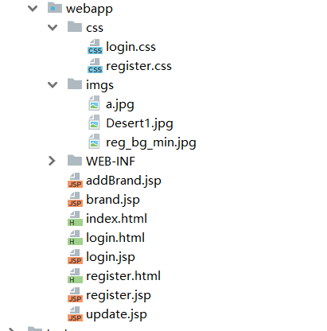
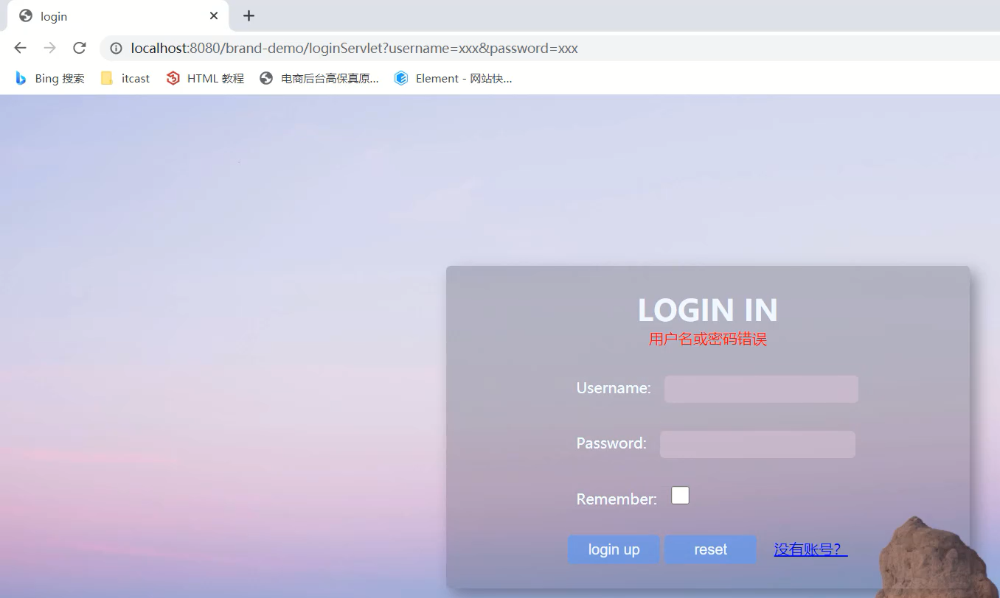
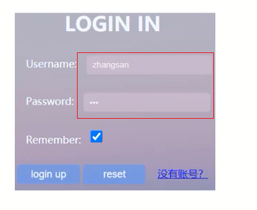
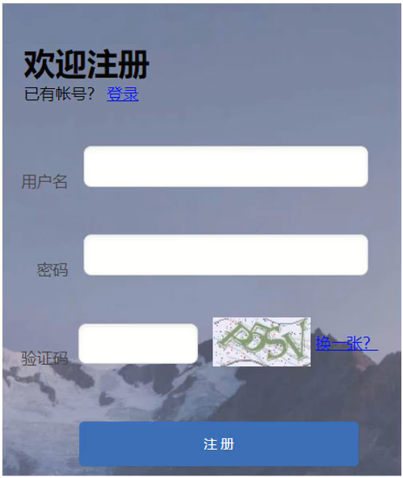
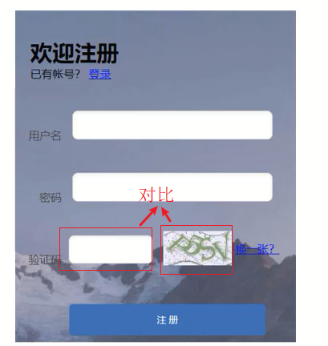

## 会话技术

掌握知识点：

* 理解什么是会话跟踪技术

* 掌握Cookie的使用
* 掌握Session的使用
* 完善用户登录注册案例的功能

------

## 1 会话跟踪技术的概述

### 1.1 概念

**会话**：

用户打开浏览器，访问web服务器的资源，会话建立，直到有一方断开连接，会话结束。**在一次会话中可以包含多次请求和响应**。

* 从浏览器发出请求到服务端响应数据给前端之后，一次会话（在浏览器和服务器之间）就被建立了
* 会话被建立后，如果浏览器或服务端都没有被关闭，则会话就会持续建立着
* 浏览器和服务器就可以继续使用该会话进行请求发送和响应，上述的整个过程就被称之为**会话**。

**会话跟踪**：

一种维护浏览器状态的方法，服务器需要识别多次请求是否来自于同一浏览器，以便在**同一次会话的多次请求间共享数据**。

* 服务器会收到多个请求，这多个请求可能来自多个浏览器，如下图中的6个请求来自3个浏览器
* 服务器需要用来识别请求是否来自同一个浏览器
* 服务器用来识别浏览器的过程，这个过程就是**会话跟踪**
* 服务器识别浏览器后就可以在同一个会话中多次请求之间来共享数据


每个浏览器都会与服务端建立了一个会话，图中加起来总共是**3**个会话。

> 举例：
>
> - 购物车： `加入购物车`和`去购物车结算`是两次请求，但是后面这次请求要想展示前一次请求所添加的商品，就需要用到数据共享。
>
> - 页面展示用户登录信息：很多网站，登录后访问多个功能发送多次请求后，浏览器上都会有当前登录用户的信息[用户名]，比如百度、京东、码云等。
> - 网站登录页面的`记住我`功能：当用户登录成功后，勾选`记住我`按钮后下次再登录的时候，网站就会自动填充用户名和密码，简化用户的登录操作，多次登录就会有多次请求，他们之间也涉及到共享数据

**为什么现在浏览器和服务器不支持数据共享呢？**

* 浏览器和服务器之间使用的是HTTP请求来进行数据传输
* HTTP协议是**无状态**的，即服务器无法判断用户身份，每次浏览器向服务器请求时，服务器都会将该请求视为**新的**请求
* HTTP协议设计成无状态的目的是让每次请求之间相互独立，互不影响
* 请求与请求之间独立后，就无法实现多次请求之间的数据共享

**会话跟踪技术具体实现方式**：

- 客户端会话跟踪技术：**Cookie**

- 服务端会话跟踪技术：**Session**
- 两个技术都可以实现会话跟踪，最大的区别：**Cookie是存储在浏览器端而Session是存储在服务器端**

------

## 2 Cookie

掌握知识点：

* 什么是Cookie？
* Cookie如何来使用？
* Cookie是如何实现的？
* Cookie的使用注意事项有哪些？

### 2.1 Cookie简介

#### 2.1.1 概念

**Cookie**：客户端会话技术，将数据保存到客户端，以后客户端每次请求都携带Cookie数据进行访问。

Cookie实际上是一小段的文本信息（key-value格式）。客户端向服务器发起请求，如果服务器需要记录该用户状态，就使用response向客户端浏览器颁发一个Cookie。客户端浏览器会把Cookie保存起来。当浏览器再请求该网站时，浏览器把请求的网址连同该Cookie一同提交给服务器。服务器检查该Cookie，以此来辨认用户状态。

打个比方，我们去银行办理储蓄业务，第一次给你办了张银行卡，里面存放了身份证、密码、手机等个人信息。当你下次再来这个银行时，银行机器能识别你的卡，从而能够直接办理业务。

#### 2.1.2 Cookie的机制

**Cookie的实现原理是基于HTTP协议的**，当用户第一次访问并登陆一个网站的时候，cookie的设置以及发送会经历以下4个步骤：

- 客户端发送一个请求到服务器（Tomcat） 
- 服务器发送一个HttpResponse响应到客户端，其中包含**Set-Cookie**的响应头 

服务器（Tomcat）基于HTTP协议来响应数据，当Tomcat发现后端要返回的是一个Cookie对象之后，Tomcat就会在响应头中添加一行数据**Set-Cookie:username=zs**

- 客户端保存cookie，之后客户端向服务器发送请求时，HttpRequest请求中会包含一个**Cookie**的请求头

客户端获取到响应结果后，从响应头中就可以获取到Set-Cookie对应值username=zs，并将数据存储在浏览器的内存中。客户端再次发送请求给服务器的时候，浏览器会自动在请求头中添加**`Cookie:username=zs`**发送给服务端。Request对象会把请求头中cookie对应的值封装成一个个Cookie对象，最终形成一个数组。

- 服务器返回响应数据


> 举例：
>
> 在doGet方法中，new了一个Cookie对象并将其加入到了HttpResponse对象中
>
> ```java
> protected void doGet(HttpServletRequest req, HttpServletResponse resp) throws ServletException, IOException {
>     
>     Cookie cookie = new Cookie("mcrwayfun", System.currentTimeMillis() + "");
>     // 设置生命周期为MAX_VALUE
>     cookie.setMaxAge(Integer.MAX_VALUE);
>     resp.addCookie(cookie);
>     
> }
> ```
>
> 浏览器输入地址进行访问，结果如图所示：
>
> 
>
> **可见Response Headers中包含Set-Cookie头部，而Request Headers中包含了Cookie头部。name和value正是上述设置的。**

#### 2.1.3 Cookie的基本使用（Servlet中编写）

对于Cookie的操作主要分两大类，分别是**发送Cookie**和**获取Cookie**：

- **发送Cookie**：

```java
// 建Cookie对象 并设置数据
Cookie cookie = new Cookie("key","value");
// 发送Cookie到客户端：使用response对象
response.addCookie(cookie);
```

- **获取Cookie**：

```java
// 获取客户端携带的所有Cookie，使用request对象
Cookie[] cookies = request.getCookies();
// 遍历数组，获取每一个Cookie对象：for
for (Cookie cookie ： cookies) {
}
// 使用Cookie对象方法获取数据
cookie.getName();
cookie.getValue();
```

> 举例：
>
> 发送Cookie：在AServlet中生成Cookie对象并存入数据，然后将数据发送给浏览器
>
> ```java
> @WebServlet("/aServlet")
> public class AServlet extends HttpServlet {
>     @Override
>     protected void doGet(HttpServletRequest request, HttpServletResponse response) throws ServletException, IOException {
>         //发送Cookie
>         //1. 创建Cookie对象
>         Cookie cookie = new Cookie("username","zs");
>         //2. 发送Cookie，response
>         response.addCookie(cookie);
>     }
> 
>     @Override
>     protected void doPost(HttpServletRequest request, HttpServletResponse response) throws ServletException, IOException {
>         this.doGet(request, response);
>     }
> }
> ```
>
> 查看效果：在浏览器查看Cookie对象中的值，访问`http：//localhost：8080/cookie-demo/aServlet`
>
> 
>
> 获取Cookie：在BServlet中获取前一个案例存入在Cookie对象中的数据
>
> ```java
> @WebServlet("/bServlet")
> public class BServlet extends HttpServlet {
>     @Override
>     protected void doGet(HttpServletRequest request, HttpServletResponse response) throws ServletException, IOException {
>         //获取Cookie
>         //1. 获取Cookie数组
>         Cookie[] cookies = request.getCookies();
>         //2. 遍历数组
>         for (Cookie cookie ： cookies) {
>             //3. 获取数据
>             String name = cookie.getName();
>             if("username".equals(name)){
>                 String value = cookie.getValue();
>                 System.out.println(name+"："+value);
>                 break;
>             }
>         }
>     }
> 
>     @Override
>     protected void doPost(HttpServletRequest request, HttpServletResponse response) throws ServletException, IOException {
>         this.doGet(request, response);
>     }
> }
> ```
>
> 查看效果：在控制台打印出获取的值，访问`http：//localhost：8080/cookie-demo/bServlet`
>
> 

### 2.2 Cookie 属性项

|   属性项   |                          属性项介绍                          |
| :--------: | :----------------------------------------------------------: |
| NAME-VALUE | 键值对，可以设置要保存的 Key/Value，注意这里的 NAME 不能和其他属性项的名字一样 |
|  Expires   |       过期时间，在设置的某个时间点后该 Cookie 就会失效       |
|   Domain   | 生成该 Cookie 的域名，如 domain="[www.baidu.com](http://www.baidu.com/)" |
|    Path    |   该 Cookie 是在当前的哪个路径下生成的，如 path=/wp-admin/   |
|   Secure   |  如果设置了这个属性，那么只会在 SSH 连接时才会回传该 Cookie  |

#### 2.2.1 Expires

该属性用来设置Cookie的有效期。Cookie中的maxAge用来表示该属性，单位为秒。Cookie中通过`getMaxAge()`和`setMaxAge(int maxAge)`来读写该属性。

```java
setMaxAge(int maxAge)
getMaxAge()
```

maxAge有3种值，分别为正数，负数和0。

- 如果maxAge属性为正数，则表示该Cookie会在maxAge秒之后自动失效。浏览器会将maxAge为正数的Cookie持久化，即写到对应的Cookie文件中（每个浏览器存储的位置不一致）。无论客户关闭了浏览器还是电脑，只要还在maxAge秒之前，登录网站时该Cookie仍然有效。

- 当maxAge属性为负数，则表示该Cookie只是一个临时Cookie，不会被持久化，仅在本浏览器窗口或者本窗口打开的子窗口中有效，关闭浏览器后该Cookie立即失效。

- 当maxAge为0时，表示立即删除Cookie

> 举例：
>
> ```java
> Cookie cookie = new Cookie("mcrwayfun",System.currentTimeMillis() + "");
> // 设置生命周期为MAX_VALUE，永久有效
> cookie.setMaxAge(Integer.MAX_VALUE);
> resp.addCookie(cookie);
> ```
>
> ```java
> Cookie cookie = new Cookie("mcrwayfun",System.currentTimeMillis() + "");
> // MaxAge为负数，是一个临时Cookie，不会持久化
> cookie.setMaxAge(-1);
> resp.addCookie(cookie);
> ```

**那么maxAge设置为负值和0到底有什么区别呢？**

maxAge设置为0表示立即删除该Cookie，如果在debug的模式下，执行上述方法，可以看见cookie立即被删除了。


maxAge设置为负数，能看到Expires属性改变了，但Cookie仍然会存在一段时间直到关闭浏览器或者重新打开浏览器。


#### 2.2.2 修改或删除Cookie

HttpServletResponse提供的Cookie操作只有一个addCookie(Cookie cookie)，所以想要修改Cookie只能使用一个同名的Cookie来覆盖原先的Cookie。如果要删除某个Cookie，则只需要新建一个同名的Cookie，并将maxAge设置为0，并覆盖原来的Cookie即可。

新建的Cookie，除了value、maxAge之外的属性，比如name、path、domain都必须与原来的一致才能达到修改或者删除的效果。否则，浏览器将视为两个不同的Cookie不予覆盖。

值得注意的是，从客户端读取Cookie时，包括maxAge在内的其他属性都是不可读的，也不会被提交。浏览器提交Cookie时只会提交name和value属性，maxAge属性只被浏览器用来判断Cookie是否过期，而不能用服务端来判断。


我们无法在服务端通过cookie.getMaxAge()来判断该cookie是否过期，maxAge只是一个只读属性，值永远为-1。当cookie过期时，浏览器在与后台交互时会自动筛选过期cookie，过期了的cookie就不会被携带了。

#### 2.2.3 Cookie的域名

Cookie是不可以跨域名的，隐私安全机制禁止网站非法获取其他网站的Cookie。

正常情况下，同一个一级域名下的两个二级域名也不能交互使用Cookie，比如test1.guan.com和test2.guan.com，因为二者的域名不完全相同。如果想要guan.com名下的二级域名都可以使用该Cookie，需要设置Cookie的domain参数为**.guan.com**，这样使用test1.guan.com和test2.guan.com就能访问同一个cookie

- 一级域名又称为顶级域名，一般由字符串+后缀组成。熟悉的一级域名有：baidu.com，qq.com。其中，com，cn，net等均是常见的后缀。
- 二级域名是在一级域名下衍生的，比如有个一级域名为[mcrfun.com](http://mcrfun.com)，则[blog.mcrfun.com](http://blog.mcrfun.com)和[www.mcrfun.com](http://www.mcrfun.com)均是其衍生出来的二级域名。

#### 2.2.4 Cookie的路径

path属性决定允许访问Cookie的路径。比如，设置为"/"表示允许所有路径都可以使用Cookie。

### 2.3 Cookie使用细节

**Cookie不能直接存储中文**，如果需要存储中文，就需要进行转码，具体的实现思路为：

- 请求A和请求B在一次会话中
- 在服务端请求A中对中文进行URL编码，采用URLEncoder.encode()，将编码后的值存入Cookie中
- 在服务端请求B中获取Cookie中的值，获取的值为URL编码后的值
- 将获取的值在进行URL解码，采用URLDecoder.decode()，就可以获取到对应的中文值

> 举例：
>
> 在AServlet中对中文进行URL编码
>
> ```java
> @WebServlet("/aServlet")
> public class AServlet extends HttpServlet {
>     @Override
>     protected void doGet(HttpServletRequest request, HttpServletResponse response) throws ServletException, IOException {
>         //发送Cookie
>         String value = "张三";
>         //对中文进行URL编码
>         value = URLEncoder.encode(value, "UTF-8");
>         System.out.println("存储数据："+value);
>         //将编码后的值存入Cookie中
>         Cookie cookie = new Cookie("username",value);
>         //设置存活时间 1周 7天
>         cookie.setMaxAge(60*60*24*7);
>         //2. 发送Cookie，response
>         response.addCookie(cookie);
>     }
> 
>     @Override
>     protected void doPost(HttpServletRequest request, HttpServletResponse response) throws ServletException, IOException {
>         this.doGet(request, response);
>     }
> }
> ```
>
> 在BServlet中获取值，并对值进行解码
>
> ```java
> @WebServlet("/bServlet")
> public class BServlet extends HttpServlet {
>     @Override
>     protected void doGet(HttpServletRequest request, HttpServletResponse response) throws ServletException, IOException {
>         //获取Cookie
>         //1. 获取Cookie数组
>         Cookie[] cookies = request.getCookies();
>         //2. 遍历数组
>         for (Cookie cookie ： cookies) {
>             //3. 获取数据
>             String name = cookie.getName();
>             if("username".equals(name)){
>                 String value = cookie.getValue();//获取的是URL编码后的值 %E5%BC%A0%E4%B8%89
>                 //URL解码
>                 value = URLDecoder.decode(value,"UTF-8");
>                 System.out.println(name+"："+value);//value解码后为 张三
>                 break;
>             }
>         }
>     }
> 
>     @Override
>     protected void doPost(HttpServletRequest request, HttpServletResponse response) throws ServletException, IOException {
>         this.doGet(request, response);
>     }
> }
> ```
>
> 至此，就可以将中文存入Cookie中进行使用。

------

## 3 Session

掌握知识点：

- 什么是Session?
- Session如何来使用?
- Session是如何实现的?
- Session的使用注意事项有哪些?

### 3.1 Session简介

#### 3.1.1 概念

Session：服务端会话跟踪技术，将数据保存到服务端， 是服务器端使用的一种记录客户端状态的机制，使用上比Cookie简单一些，相应的也增加了服务器的存储压力。 

* Session是存储在服务端 (内存或硬盘) 而Cookie是存储在客户端
* 存储在客户端的数据容易被窃取和截获，存在很多不安全的因素
* 存储在服务端的数据相比于客户端来说就更安全

客户端浏览器访问服务器的时候，服务器把客户端信息以类似于散列表的形式记录在服务器上，这就是Session。客户端浏览器再次访问时只需要从该Session中查找该客户的状态就可以了。

> 可以把Session简单的理解为个人的储物柜，每个人有一个唯一对应的储物柜，用户可以根据手里的钥匙来操作储物柜。
>
> 比如说是一家健身房，当我们进入健身房后，前台小妹会给我们一把储物柜的钥匙（Cookie），我们拿着钥匙找到对应的柜子（Session），换装，健身…，换装，归还钥匙，此次健身结束。

当程序需要为某个客户端的请求创建一个session时，服务器首先检查这个客户端的请求里是否包含一个session标识(即，sessionId)。如果已经包含一个sessionId说明以前已经为此客户端创建过session，服务器就按照sessionId把这个session检索出来使用。

如果客户请求不包含sessionId，则为此客户创建一个session并且生成一个与此session相关的sessionId，这个sessionId将在本次响应中返回给客户端保存。

#### 3.1.2 Session的机制

- 客户端第一次请求服务器时，服务器端会生成一个sessionid

- 服务器端将生成的sessionid返回给客户端，通过set-cookie
- 客户端收到sessionid会将它保存在cookie中，当客户端再次访问服务端时会带上这个sessionid
- 当服务端再次接收到来自客户端的请求时，会先去检查是否存在sessionid，不存在就新建一个sessionid重复1,2的流程；如果存在就去遍历服务端的session文件，找到与这个sessionid相对应的文件，文件中的键值便是sessionid，值为当前用户的一些信息
- 此后的请求都会交换这个 Session ID，进行有状态的会话。

#### 3.1.3 Session的基本使用

在JavaEE中提供了**HttpSession**接口，来实现一次会话的多次请求之间数据共享功能。

- **获取Session，使用的是request对象**：

```java
HttpSession session = request.getSession();
```

- **Session对象提供的功能**：

  * 存储数据到 session 域中

    ```java
    void setAttribute(String name, Object o)
    ```

  * 根据 key，获取值

    ```java
    Object getAttribute(String name)
    ```

  * 根据 key，删除该键值对

    ```java
    void removeAttribute(String name)
    ```

  > 举例：在一个Servlet中往Session中存入数据，在另一个Servlet中获取Session中存入的数据
  >
  > 在SessionDemo1的方法中：获取Session对象、存储数据
  >
  > ```java
  > @WebServlet("/demo1")
  > public class SessionDemo1 extends HttpServlet {
  >     @Override
  >     protected void doGet(HttpServletRequest request, HttpServletResponse response) throws ServletException, IOException {
  >     	//存储到Session中
  >         //1. 获取Session对象
  >         HttpSession session = request.getSession();
  >         //2. 存储数据
  >         session.setAttribute("username","zs");
  >     }
  > 
  >     @Override
  >     protected void doPost(HttpServletRequest request, HttpServletResponse response) throws ServletException, IOException {
  >         this.doGet(request, response);
  >     }
  > }
  > ```
  >
  > 在SessionDemo2的方法中：获取Session对象、获取数据
  >
  > ```java
  > @WebServlet("/demo2")
  > public class SessionDemo2 extends HttpServlet {
  >     @Override
  >     protected void doGet(HttpServletRequest request, HttpServletResponse response) throws ServletException, IOException {
  >         //获取数据，从session中
  >         //1. 获取Session对象
  >         HttpSession session = request.getSession();
  >         //2. 获取数据
  >         Object username = session.getAttribute("username");
  >         System.out.println(username);
  >     }
  > 
  >     @Override
  >     protected void doPost(HttpServletRequest request, HttpServletResponse response) throws ServletException, IOException {
  >         this.doGet(request, response);
  >     }
  > }
  > ```
  >
  > 查看效果：
  >
  > * 先访问`http：//localhost：8080/cookie-demo/demo1`，将数据存入Session
  > * 在访问`http：//localhost：8080/cookie-demo/demo2`，从Session中获取数据
  > * 查看控制台
  >
  > 

### 3.2 Session 属性项

和Cookie相同，Tomcat在Servlet Api中提供了一个HttpSession接口，其中提供一些方法，让我们可以方便的操作Session，比如存储会话数据，设置一些属性等。


其中的setAttribute、getAttribute、removeAtrribute方法是用来向Session这个储物柜中存取数据的，Session的也是一个域对象

还可以通过setMaxInactiveInterval方法，来设置Session的空闲超时间隔，默认的空闲超时间隔为30分钟。

这里简单的解释下空闲超时间隔，比如客户端A在9点登入系统，创建了对应的Cookie和Session，此时对应Session的失效时间为9点30；如果用户在9点25时，在页面上向服务器发起了请求，那么对应Session的过期时间则变为9点55；如果在接下来的半小时，也就是9点55之前，客户端没有向服务器发起任何请求，则此Session会自动被销毁，解绑所有的绑定在此Session上的属性。如果想修改当前应用中所有Session的默认超时间隔，则可以在web.xml中增加如下配置：

```xml
<session-config>
  <session-timeout>30</session-timeout>
</session-config>
```

在web.xml中配置的最大空闲超时间隔的单位是分钟，默认配置为30分钟。当session-timeout的值为0或者负数时，表示会话永不超时。不过不建议这么设置，因为Session中空闲超时时间存在的目的，就是可以让服务器能自动回收那些近期不在活跃的客户端对应的Session，这样才能保证内存资源不会因为积累大量的不活跃Session而耗尽。当然，当用户点击退出，主动结束会话时，我们同样可以使用invalidate方法来立即回收此Session。

### 3.3 Session使用细节

主要掌握两个知识，第一个是Session的钝化和活化，第二个是Session的销毁。

#### 3.3.1 Session钝化与活化

服务器正常关闭和启动，session中的数据可以被保存下来的。

正常关闭和启动：

需要使用命令行的方式来启动和停止Tomcat服务器：

- **启动**：进入到项目pom.xml所在目录，执行`tomcat7：run`

- **停止**：在启动的命令行界面，输入`ctrl+c`

可以正常保存的原因：

* **钝化：在服务器正常关闭后，Tomcat会自动将Session数据写入硬盘的文件中**

  * 钝化的数据路径为：`项目目录\target\tomcat\work\Tomcat\localhost\项目名称\SESSIONS.ser`

    

* **活化：再次启动服务器后，从文件中加载数据到Session中**

  * 数据加载到Session中后，路径中的`SESSIONS.ser`文件会被删除掉

对于上述的整个过程，只需要了解下即可。因为所有的过程都是Tomcat完成的，不需要我人为参与

### 3.4 问题

Cookie和Session的区别是什么？Cookie和Session的应用场景分别是什么？

* 区别：
  * 存储位置：Cookie 是将数据存储在客户端，Session 将数据存储在服务端
  * 安全性：Cookie不安全，Session安全
  * 数据大小：Cookie最大3KB，Session无大小限制
  * 存储时间：Cookie可以通过setMaxAge()长期存储，Session默认30分钟
  * 服务器性能：Cookie不占服务器资源，Session占用服务器资源
* 应用场景：
  * 购物车：使用Cookie来存储
  * 以登录用户的名称展示：使用Session来存储
  * 记住我功能：使用Cookie来存储
  * 验证码：使用session来存储
* 结论
  * Cookie是用来保证用户在未登录情况下的身份识别
  * Session是用来保存用户登录后的数据

------

## 4 用户登录注册案例

### 4.1 需求分析

需求说明：

- 完成**用户登录功能**，如果用户勾选“记住用户” ，则下次访问登录页面**自动**填充用户名密码

- 完成**注册功能**，并实现**验证码**功能


### 4.2 用户登录功能

#### 4.2.1 需求

* 用户登录成功后，跳转到列表页面，并在页面上展示当前登录的用户名称
* 用户登录失败后，跳转回登录页面，并在页面上展示对应的错误信息

#### 4.2.2 实现流程分析


- 浏览器
  - 前端通过表单发送请求和数据给Web层的LoginServlet

- Web层
  - 在LoginServlet中接收请求和数据[用户名和密码]
  - LoginServlet接收到请求和数据后，调用Service层完成根据用户名和密码查询用户对象

- Service层
  - 在Service层需要编写UserService类，在类中实现login方法，方法中调用Dao层的UserMapper

- Dao层
  - 在UserMapper接口中，声明一个根据用户名和密码查询用户信息的方法
  - Dao层把数据查询出来以后，将返回数据封装到User对象，将对象交给Service层

- Service层
  - Service层将数据返回给Web层

- Web层
  - Web层获取到User对象后，判断User对象，如果为Null，则将错误信息响应给登录页面；如果不为Null，则跳转到列表页面，并把当前登录用户的信息存入Session携带到列表页面。

#### 4.2.3 具体实现

1）Dao层的代码编写

- mapper目录：实现sql的功能

```java
public interface UserMapper {
    
    /**
     * 根据用户名和密码查询用户对象
     * @param username
     * @param password
     * @return
     */
    @Select("select * from tb_user where username = #{username} and password = #{password}")
    User select(@Param("username") String username,@Param("password")  String password);
    
    /**
     * 根据用户名查询用户对象
     * @param username
     * @return
     */
    @Select("select * from tb_user where username = #{username}")
    User selectByUsername(String username);
    /**
     * 添加用户
     * @param user
     */
    @Insert("insert into tb_user values(null,#{username},#{password})")
    void add(User user);
}
```

- pojo目录：实体类的编写

```java
public class User {

    private Integer id;
    private String username;
    private String password;

    public Integer getId() {
        return id;
    }
    public void setId(Integer id) {
        this.id = id;
    }
    public String getUsername() {
        return username;
    }
    public void setUsername(String username) {
        this.username = username;
    }
    public String getPassword() {
        return password;
    }
    public void setPassword(String password) {
        this.password = password;
    }

    @Override
    public String toString() {
        return "User{" +
                "id=" + id +
                ", username='" + username + '\'' +
                ", password='" + password + '\'' +
                '}';
    }
}
```

- resources/mapper目录：Dao层对应的xml文件

```xml
<？xml version="1.0" encoding="UTF-8" ？>
<!DOCTYPE mapper
        PUBLIC "-//mybatis.org//DTD Mapper 3.0//EN"
        "http：//mybatis.org/dtd/mybatis-3-mapper.dtd">
<mapper namespace="com.itheima.mapper.UserMapper">

</mapper>
```

2）Service层的代码编写

- service目录：写UserService的业务逻辑

```java
public class UserService {
    //1.使用工具类获取SqlSessionFactory
    SqlSessionFactory factory = SqlSessionFactoryUtils.getSqlSessionFactory();
    /**
     * 登录方法
     * @param username
     * @param password
     * @return
     */
    public User login(String username,String password){
        //2. 获取SqlSession
        SqlSession sqlSession = factory.openSession();
        //3. 获取UserMapper
        UserMapper mapper = sqlSession.getMapper(UserMapper.class);
        //4. 调用方法
        User user = mapper.select(username, password);
        //释放资源
        sqlSession.close();

        return  user;
    }
}
```

3）Web层的代码编写

- 将静态页面拷贝到项目的 webapp目录 下：



- 将login.html内容修改成login.jsp

```html
<%@ page contentType="text/html;charset=UTF-8" language="java" %>
<!DOCTYPE html>
<html lang="en">

<head>
    <meta charset="UTF-8">
    <title>login</title>
    <link href="css/login.css" rel="stylesheet">
</head>

<body>
<div id="loginDiv" style="height： 350px">
    <form action="/brand-demo/loginServlet" method="post" id="form">
        <h1 id="loginMsg">LOGIN IN</h1>
        <!-- 需要修改为动态的 -->
        <div id="errorMsg">用户名或密码不正确</div>
        <p>Username：<input id="username" name="username" type="text"></p>
        <p>Password：<input id="password" name="password" type="password"></p>
        <p>Remember：<input id="remember" name="remember" type="checkbox"></p>
        <div id="subDiv">
            <input type="submit" class="button" value="login up">
            <input type="reset" class="button" value="reset">&nbsp;&nbsp;&nbsp;
            <a href="register.html">没有账号？</a>
        </div>
    </form>
</div>
</body>
</html>
```

- Web目录：创建LoginServlet类

```java
@WebServlet("/loginServlet")
public class LoginServlet extends HttpServlet {
    private UserService service = new UserService();

    @Override
    protected void doGet(HttpServletRequest request, HttpServletResponse response) throws ServletException, IOException {
        //1. 获取用户名和密码
        String username = request.getParameter("username");
        String password = request.getParameter("password");
   
        //2. 调用service查询
        User user = service.login(username, password);

        //3. 判断
        if (user != null) {
            //登录成功，跳转到查询所有的BrandServlet
            
            //将登陆成功后的user对象，存储到session
            HttpSession session = request.getSession();
            session.setAttribute("user",user);
            
            String contextPath = request.getContextPath();
            response.sendRedirect(contextPath+"/selectAllServlet");
        } else {
            // 登录失败
            // 存储错误信息到request
            request.setAttribute("login_msg","用户名或密码错误");
            // 跳转到login.jsp
            request.getRequestDispatcher("/login.jsp").forward(request,response);
        }
    }

    @Override
    protected void doPost(HttpServletRequest request, HttpServletResponse response) throws ServletException, IOException {
        this.doGet(request, response);
    }
}
```

- 在`brand.jsp`中<body>标签下添加欢迎当前用户的提示信息：

```xml
<h1>${user.username},欢迎您</h1>
```

-  修改`login.jsp`，将错误信息使用**EL表达式**来获取

```jsp
修改前内容：<div id="errorMsg">用户名或密码不正确</div>
修改后内容：<div id="errorMsg">${login_msg}</div>
```

#### 4.2.4 启动访问测试

- 进入登录页面，输入错误的用户名或密码



- 输入正确的用户和密码信息


#### 4.2.5 小结

* 在LoginServlet中，将登录成功的用户数据存入session中，方法在列表页面中获取当前登录用户信息进行展示
* 在LoginServlet中，将登录失败的错误信息存入到request中，如果存入到session中就会出现这次会话的所有请求都有登录失败的错误信息，这个是不需要的，所以不用存入到session中

### 4.3 记住我-设置Cookie

#### 4.3.1 需求

如果用户勾选“记住用户” ，则下次访问登陆页面自动填充用户名密码。


对应上面这个需求，最大的问题就是： 如何自动填充用户名和密码？

#### 4.3.2 实现流程分析

**记住我功能**：要实现的效果是，就算用户把浏览器关闭过几天再来访问也能自动填充，所以需要将登陆信息存入一个可以长久保存，并且能够在浏览器关闭重新启动后依然有效的地方，所以需要使用**Cookie**。

* 将用户名和密码写入**Cookie**中，并且持久化存储Cookie，下次访问浏览器会自动携带Cookie
* 在页面获取Cookie数据后，设置到用户名和密码框中
* 何时写入Cookie？
  * 用户必须登陆成功后才需要写
  * 用户必须在登录页面勾选了**记住我**的复选框


实现流程：

- 前端需要在发送请求和数据的时候，多携带一个用户是否勾选`Remember`的数据

- LoginServlet获取到数据后，调用Service完成用户名和密码的判定

- 登录成功，并且用户在前端勾选了`记住我`，需要往Cookie中写入用户名和密码的数据，并设置Cookie存活时间

- 设置成功后，将数据响应给前端

#### 4.3.3 具体实现

- 在login.jsp为复选框设置值

```jsp
<%@ page contentType="text/html;charset=UTF-8" language="java" %>
<!DOCTYPE html>
<html lang="en">

<head>
    <meta charset="UTF-8">
    <title>login</title>
    <link href="css/login.css" rel="stylesheet">
</head>

<body>
<div id="loginDiv" style="height： 350px">
    <form action="/brand-demo/loginServlet" method="post" id="form">
        <h1 id="loginMsg">LOGIN IN</h1>
        <div id="errorMsg">${login_msg}</div>
        <p>Username：<input id="username" name="username" type="text"></p>
        <p>Password：<input id="password" name="password" type="password"></p>
    	<!--在remember，设置值value="1" -->
        <p>Remember：<input id="remember" name="remember" value="1" type="checkbox"></p>
        <div id="subDiv">
            <input type="submit" class="button" value="login up">
            <input type="reset" class="button" value="reset">&nbsp;&nbsp;&nbsp;
            <a href="register.html">没有账号？</a>
        </div>
    </form>
</div>
</body>
</html>
```

- 在LoginServlet获取复选框的值并在登录成功后进行设置Cookie

```java
@WebServlet("/loginServlet")
public class LoginServlet extends HttpServlet {
    private UserService service = new UserService();

    @Override
    protected void doGet(HttpServletRequest request, HttpServletResponse response) throws ServletException, IOException {
        //1. 获取用户名和密码
        String username = request.getParameter("username");
        String password = request.getParameter("password");

        //获取复选框数据
        String remember = request.getParameter("remember");

        //2. 调用service查询
        User user = service.login(username, password);

        //3. 判断
        if(user != null){
            //登录成功，跳转到查询所有的BrandServlet

            //判断用户是否勾选记住我
            //字符串写前面是为了避免出现空指针异常
            if("1".equals(remember)){
                //勾选了，发送Cookie
                //1. 创建Cookie对象
                Cookie c_username = new Cookie("username",username);
                Cookie c_password = new Cookie("password",password);
                // 设置Cookie的存活时间
                c_username.setMaxAge( 60 * 60 * 24 * 7);
                c_password.setMaxAge( 60 * 60 * 24 * 7);
                //2. 发送
                response.addCookie(c_username);
                response.addCookie(c_password);
            }

            //将登陆成功后的user对象，存储到session
            HttpSession session = request.getSession();
            session.setAttribute("user",user);

            String contextPath = request.getContextPath();
            response.sendRedirect(contextPath+"/selectAllServlet");
        }else {
            // 登录失败
            
            // 存储错误信息到request
            request.setAttribute("login_msg","用户名或密码错误");
            // 跳转到login.jsp
            request.getRequestDispatcher("/login.jsp").forward(request,response);
        }
    }

    @Override
    protected void doPost(HttpServletRequest request, HttpServletResponse response) throws ServletException, IOException {
        this.doGet(request, response);
    }
}

```

#### 4.3.4 启动访问测试

只有当前用户名和密码输入正确，并且勾选了Remeber的复选框，在响应头中才可以看得cookie的相关数据


### 4.4 记住我-获取Cookie

#### 4.4.1 需求

登录成功并勾选了Remeber后，**后端返回给前端**的Cookie数据就已经存储好了，接下来就需要在页面获取Cookie中的数据，并把数据设置到登录页面的用户名和密码框中。



如何在页面直接获取Cookie中的值呢？

#### 4.4.2 实现流程分析

在页面可以使用EL表达式，`${cookie.key.value}`。

key：指的是存储在cookie中的键名称


- 在login.jsp用户名的表单输入框使用value值给表单元素添加默认值，value可以使用`${cookie.username.value}`

- 在login.jsp密码的表单输入框使用value值给表单元素添加默认值，value可以使用`${cookie.password.value}`

#### 4.4.3 具体实现

- 修改login.jsp页面

```jsp
<%@ page contentType="text/html;charset=UTF-8" language="java" %>
<!DOCTYPE html>
<html lang="en">

<head>
    <meta charset="UTF-8">
    <title>login</title>
    <link href="css/login.css" rel="stylesheet">
</head>

<body>
<div id="loginDiv" style="height： 350px">
    <form action="/brand-demo/loginServlet" method="post" id="form">
        <h1 id="loginMsg">LOGIN IN</h1>
        <div id="errorMsg">${login_msg}</div>
        <!-- 设置值 -->
        <p>Username：<input id="username" name="username" value="${cookie.username.value}" type="text"></p>
        <p>Password：<input id="password" name="password" value="${cookie.password.value}" type="password"></p>
        <p>Remember：<input id="remember" name="remember" value="1" type="checkbox"></p>
        <div id="subDiv">
            <input type="submit" class="button" value="login up">
            <input type="reset" class="button" value="reset">&nbsp;&nbsp;&nbsp;
            <a href="register.html">没有账号？</a>
        </div>
    </form>
</div>
</body>
</html>
```

#### 4.4.4 重新访问测试

重新访问登录页面，就可以看得用户和密码已经被填充。


### 4.5 用户注册功能

#### 4.5.1 需求

* 注册功能：保存用户信息到数据库
* 验证码功能
  * 展示验证码：展示验证码图片，并可以点击切换
  * 校验验证码：验证码填写不正确，则注册失败



#### 4.5.2 实现流程分析


- 浏览器
  - 前端通过表单发送请求和数据给Web层的RegisterServlet

- Web层
  - 在RegisterServlet中接收请求和数据[用户名和密码]
  - RegisterServlet接收到请求和数据后，调用Service层完成用户信息的保存

- Service层
  - 在Service层需要编写UserService类，在类中实现**register方法**，需要判断用户是否已经存在，如果不存在，则完成用户数据的保存

- Dao层
  - 在UserMapper接口中，声明两个方法，一个是根据用户名查询用户信息方法，另一个是保存用户信息方法

- Service层
  - 在UserService类中保存成功则返回true，失败则返回false，将数据返回给Web层

- Web层
  - Web层获取到结果后，如果返回的是true，则提示`注册成功`，并转发到登录页面，如果返回false则提示`用户名已存在`并转发到注册页面

#### 4.5.3 具体实现

- Dao层

- 编写Service层代码

```java
public class UserService {
    //1.使用工具类获取SqlSessionFactory
    SqlSessionFactory factory = SqlSessionFactoryUtils.getSqlSessionFactory();
    /**
     * 注册方法
     * @return
     */

    public boolean register(User user){
        //2. 获取SqlSession
        SqlSession sqlSession = factory.openSession();
        //3. 获取UserMapper
        UserMapper mapper = sqlSession.getMapper(UserMapper.class);
        //4. 判断用户名是否存在
        User u = mapper.selectByUsername(user.getUsername());

        if(u == null){
            // 用户名不存在，注册
            mapper.add(user);
            sqlSession.commit();
        }
        sqlSession.close();
        return u == null;
    }
}
```

- 完成页面的代码编写

将register.html内容修改成register.jsp

```jsp
<%@ page contentType="text/html;charset=UTF-8" language="java" %>
<!DOCTYPE html>
<html lang="en">
<head>
    <meta charset="UTF-8">
    <title>欢迎注册</title>
    <link href="css/register.css" rel="stylesheet">
</head>
<body>
<div class="form-div">
    <div class="reg-content">
        <h1>欢迎注册</h1>
        <span>已有帐号？</span> <a href="login.html">登录</a>
    </div>
    <form id="reg-form" action="/brand-demo/registerServlet" method="post">
        <table>
            <tr>
                <td>用户名</td>
                <td class="inputs">
                    <input name="username" type="text" id="username">
                    <br>
                    <span id="username_err" class="err_msg" style="display：none">用户名不太受欢迎</span>
                </td>
            </tr>
            <tr>
                <td>密码</td>
                <td class="inputs">
                    <input name="password" type="password" id="password">
                    <br>
                    <span id="password_err" class="err_msg" style="display： none">密码格式有误</span>
                </td>
            </tr>
            <tr>
                <td>验证码</td>
                <td class="inputs">
                    <input name="checkCode" type="text" id="checkCode">
                    
                    <a href="#" id="changeImg" >看不清？</a>
                </td>
            </tr>
        </table>
        <div class="buttons">
            <input value="注 册" type="submit" id="reg_btn">
        </div>
        <br class="clear">
    </form>
</div>
</body>
</html>
```

- 编写RegisterServlet

```java
@WebServlet("/registerServlet")
public class RegisterServlet extends HttpServlet {
    private UserService service = new UserService();

    @Override
    protected void doGet(HttpServletRequest request, HttpServletResponse response) throws ServletException, IOException {
       //1. 获取用户名和密码数据
        String username = request.getParameter("username");
        String password = request.getParameter("password");
        
        User user = new User();
        user.setUsername(username);
        user.setPassword(password);

        //2. 调用 service 注册
        boolean flag = service.register(user);
        
        //3. 判断注册成功与否
        if(flag){
             //注册功能，跳转登陆页面
            request.setAttribute("register_msg","注册成功，请登录");
            request.getRequestDispatcher("/login.jsp").forward(request,response);
        }else {
            //注册失败，跳转到注册页面
            request.setAttribute("register_msg","用户名已存在");
            request.getRequestDispatcher("/register.jsp").forward(request,response);
        }
    }

    @Override
    protected void doPost(HttpServletRequest request, HttpServletResponse response) throws ServletException, IOException {
        this.doGet(request, response);
    }
}
```

- 需要在页面上展示后台返回的错误信息，需要修改register.jsp

```jsp
修改前：<span id="username_err" class="err_msg" style="display：none">用户名不太受欢迎</span>
修改后：<span id="username_err" class="err_msg">${register_msg}</span>
```

- 如果注册成功，需要把成功信息展示在登录页面，所以也需要修改login.jsp

```jsp
修改前：<div id="errorMsg">${login_msg}</div>
修改后：<div id="errorMsg">${login_msg} ${register_msg}</div>
```

- 修改login.jsp，将注册跳转地址修改为register.jsp

```jsp
修改前：<a href="register.html">没有账号？</a>
修改后：<a href="register.jsp">没有账号？</a>
```

#### 4.5.4 启动测试

如果是注册的用户信息已经存在：


如果注册的用户信息不存在，注册成功：


### 4.6 验证码-展示

验证码简介：

* 验证码就是使用Java代码生成的一张图片
* 验证码的作用：**防止机器自动注册，攻击服务器**

#### 4.6.1 需求分析

展示验证码图片，并可以点击切换


验证码的生成是通过工具类来实现的，具体的工具类参考`CheckCodeUtil.java`

在该工具类中编写main方法进行测试：

```java
public static void main(String[] args) throws IOException {
    // 生成验证码的图片位置
    OutputStream fos = new FileOutputStream("d：//a.jpg");
    // checkCode为最终验证码的数据
    String checkCode = CheckCodeUtil.outputVerifyImage(100, 50, fos, 4);
    System.out.println(checkCode);
}
```

#### 4.6.2 实现流程分析


- 浏览器
  - 前端发送请求给CheckCodeServlet

- Web层
  - CheckCodeServlet接收到请求后，生成验证码图片，将图片用Reponse对象的输出流写回到前端

如何将图片写回到前端浏览器呢？

- Java中已经有工具类生成验证码图片，测试类中只是把图片生成到磁盘上
- 生成磁盘的过程中使用的是OutputStream流，如何把这个图片生成在页面呢？
- 前面在将Reponse对象的时候，它有一个方法可以获取其字节输出流，getOutputStream()

综上所述，可以把写往磁盘的流对象更改成Response的字节流，即可完成图片响应给前端

#### 4.6.3 具体实现

- 修改Register.jsp页面，将验证码的图片从后台获取

```jsp
<tr>
    <td>验证码</td>
        <td class="inputs">
        <input name="checkCode" type="text" id="checkCode">
        
        <a href="#" id="changeImg" >看不清？</a>
    </td>
</tr>

<script>
    document.getElementById("changeImg").onclick = function () {
       	<!-- 路径后面添加时间戳的目的是避免浏览器进行缓存静态资源 -->
        document.getElementById("checkCodeImg").src = "/brand-demo/checkCodeServlet？"+new Date().getMilliseconds();
    }
</script>
```

- 编写CheckCodeServlet类，用来接收请求生成验证码

```java
@WebServlet("/checkCodeServlet")
public class CheckCodeServlet extends HttpServlet {
    @Override
    protected void doGet(HttpServletRequest request, HttpServletResponse response) throws ServletException, IOException {
        // 生成验证码
        ServletOutputStream os = response.getOutputStream();
        String checkCode = CheckCodeUtil.outputVerifyImage(100, 50, os, 4);
    }

    @Override
    protected void doPost(HttpServletRequest request, HttpServletResponse response) throws ServletException, IOException {
        this.doGet(request, response);
    }
}
```

### 4.7 验证码-校验

#### 4.7.1 需求

* 判断 程序生成 的验证码和 用户输入 的验证码 是否一样，如果不一样，则阻止注册
* 验证码图片访问和提交注册表单是**两次**请求，所以要将程序生成的验证码存入Session中



为什么要把验证码数据存入到Session中呢？

* 生成验证码和校验验证码是**两次请求**，此处就需要在一个会话的两次请求之间共享数据
* 验证码属于安全数据类的，所以用Session来存储验证码数据。

#### 4.7.2 实现流程分析


- 在CheckCodeServlet中生成验证码的时候，将验证码数据存入Session对象

- 前端将验证码和注册数据提交到后台，交给RegisterServlet类

- RegisterServlet类接收到请求和数据后，其中就有验证码，和Session中的验证码进行对比

- 如果一致，则完成注册，如果不一致，则提示错误信息

#### 4.7.3 具体实现

- 修改CheckCodeServlet类，将验证码存入Session对象

```java
@WebServlet("/checkCodeServlet")
public class CheckCodeServlet extends HttpServlet {
    @Override
    protected void doGet(HttpServletRequest request, HttpServletResponse response) throws ServletException, IOException {
        // 生成验证码
        ServletOutputStream os = response.getOutputStream();
        String checkCode = CheckCodeUtil.outputVerifyImage(100, 50, os, 4);

        // 存入Session
        HttpSession session = request.getSession();
        session.setAttribute("checkCodeGen",checkCode);
    }

    @Override
    protected void doPost(HttpServletRequest request, HttpServletResponse response) throws ServletException, IOException {
        this.doGet(request, response);
    }
}
```

- 在RegisterServlet中，获取页面的和session对象中的验证码，进行对比

```java
@WebServlet("/registerServlet")
public class RegisterServlet extends HttpServlet {
    private UserService service = new UserService();

    @Override
    protected void doGet(HttpServletRequest request, HttpServletResponse response) throws ServletException, IOException {
       //1. 获取用户名和密码数据
        String username = request.getParameter("username");
        String password = request.getParameter("password");

        User user = new User();
        user.setUsername(username);
        user.setPassword(password);

        // 获取用户输入的验证码
        String checkCode = request.getParameter("checkCode");

        // 程序生成的验证码，从Session获取
        HttpSession session = request.getSession();
        String checkCodeGen = (String) session.getAttribute("checkCodeGen");

        // 比对
        if(!checkCodeGen.equalsIgnoreCase(checkCode)){
            request.setAttribute("register_msg","验证码错误");
            request.getRequestDispatcher("/register.jsp").forward(request,response);
            // 不允许注册
            return;
        }
        //2. 调用service 注册
        boolean flag = service.register(user);
        //3. 判断注册成功与否
        if(flag){
             //注册功能，跳转登陆页面
            request.setAttribute("register_msg","注册成功，请登录");
            request.getRequestDispatcher("/login.jsp").forward(request,response);
        }else {
            //注册失败，跳转到注册页面
            request.setAttribute("register_msg","用户名已存在");
            request.getRequestDispatcher("/register.jsp").forward(request,response);
        }
    }

    @Override
    protected void doPost(HttpServletRequest request, HttpServletResponse response) throws ServletException, IOException {
        this.doGet(request, response);
    }
}
```

至此，用户的注册登录功能就已经完成了。
